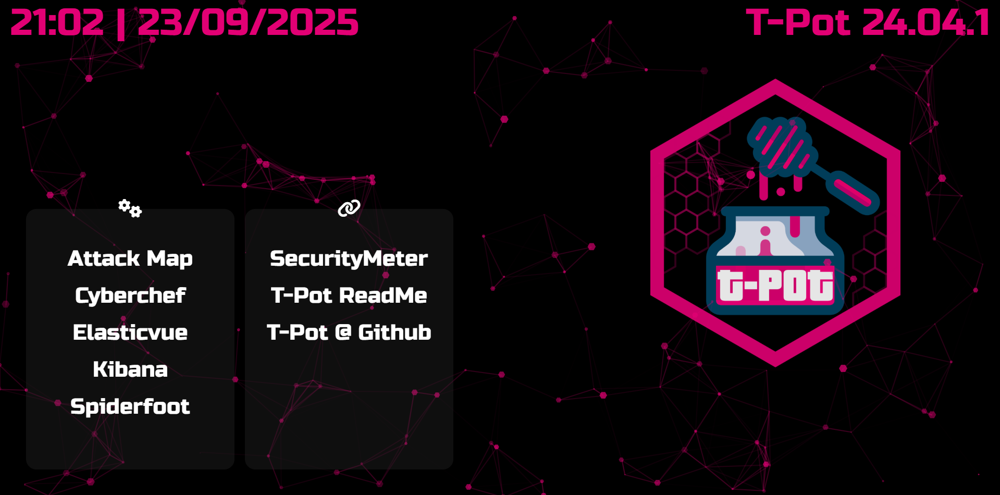
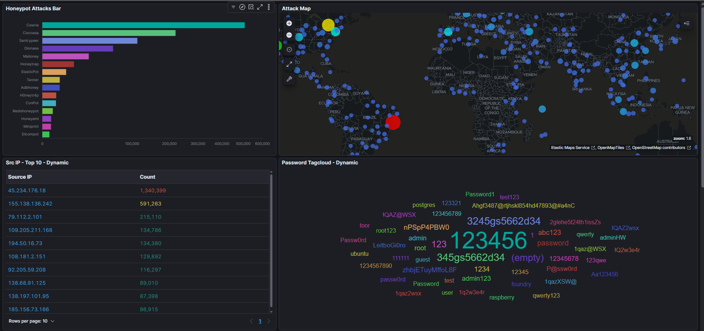
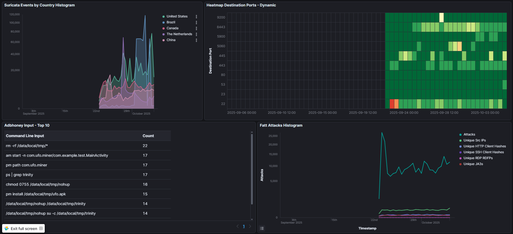

# T-Pot Honeypot Project

## Overview
This project involves deploying T-Pot CE on a Vultr VPS to capture and analyze cyber threats. The setup uses multiple honeypots to attract attackers, logs the interactions, and visualizes the data in a Kibana dashboard. Additionally, SpiderFoot was used to perform OSINT on a top attacker IP for deeper insights. The focus was on practical threat detection without custom scripting or alerting rules.

## Features
- **Honeypot Deployment:** T-Pot CE with Cowrie, Dionaea, and SentryPeer honeypots capturing over 600k attacks, including SSH brute-force, multi-protocol exploits, and SIP probes.
  
- **Data Visualization:** Kibana dashboard with pie charts for top attackers, bar charts for attack types, and geolocation maps for origin tracking.
  
  
- **OSINT Integration:** SpiderFoot scan on a top attacker IP to gather additional intel like associated domains and reputation.

## Setup and Configuration
T-Pot CE was cloned from GitHub and installed on Ubuntu 24.04 LTS with the Standard edition. Ports were exposed via UFW to allow honeypot traffic. The web interface and Kibana were accessed via the VPS IP for monitoring and visualization.

## Analysis and Findings
- Captured 19k brute-force logins, 254 successful logins, and 4.5k command inputs.
- Top attackers from countries like UAE and US, with patterns like repeated "root" logins.
- SpiderFoot scan on a top IP revealed malware-linked domains and geographic details.

[Insert screenshot here: SpiderFoot scan results for the top attacker IP, showing OSINT output]

## Credits
- T-Pot CE by Telekom Security.
- Vultr VPS for hosting.

[MIT License]
